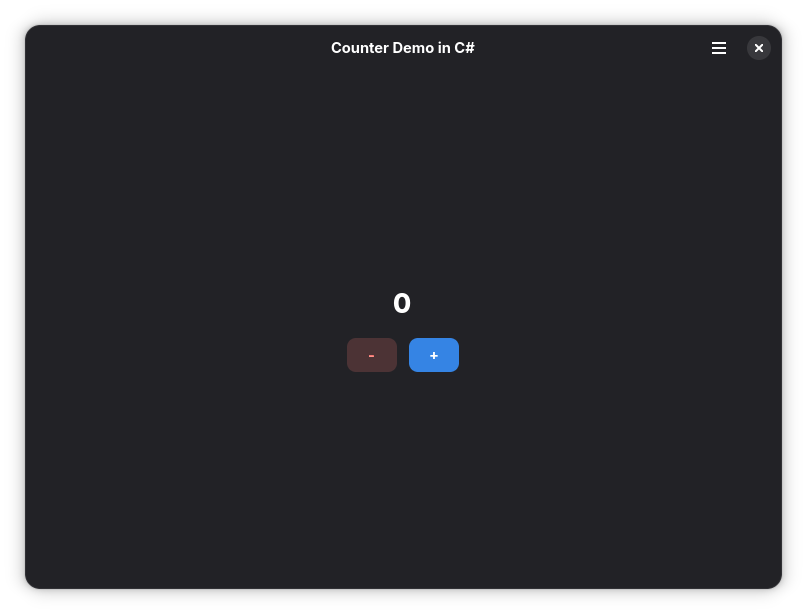

# CounterCS

A minimal GTK4/Adwaita counter application written in C# using [GirCore](https://github.com/gircore/gir.core). Serves as a reference template for building GNOME-style desktop apps with .NET, demonstrating GirCore's composite template support and an MVVM-like project structure.

## Screenshot



## Dependencies

| Dependency | Version |
|---|---|
| [.NET SDK](https://dotnet.microsoft.com/) | 10.0 |
| [GirCore.Adw-1](https://www.nuget.org/packages/GirCore.Adw-1) | 0.8.0-preview.1 |
| [GirCore.Gtk-4.0](https://www.nuget.org/packages/GirCore.Gtk-4.0) | 0.8.0-preview.1 |
| [GirCore.GObject-2.0.Integration](https://www.nuget.org/packages/GirCore.GObject-2.0.Integration) | 0.8.0-preview.1 |
| [GirCore.Gtk-4.0.Integration](https://www.nuget.org/packages/GirCore.Gtk-4.0.Integration) | 0.8.0-preview.1 |

The following native libraries must be available at runtime:

- GTK 4
- libadwaita

On NixOS, the included `flake.nix` provides a dev shell with all native dependencies.

## Building & Running

```sh
dotnet build
dotnet run --project src/suyogtandel.countercs
```

Or via Meson:

```sh
meson setup builddir
meson compile run -C builddir
```

## Project Structure

```
countercs/
├── COPYING                              # MIT License
├── countercs.slnx                       # .NET solution file
├── flake.nix                            # Nix dev shell (GTK4, libadwaita, etc.)
├── meson.build                          # Meson build definition
└── src/
    └── suyogtandel.countercs/
        ├── suyogtandel.countercs.csproj  # Project file & NuGet references
        ├── Program.cs                    # Entry point, module initialization
        ├── Application.cs                # Adw.Application subclass (actions, lifecycle)
        ├── ViewModels/
        │   └── CounterViewModel.cs       # Counter state & INotifyPropertyChanged
        └── Views/
            ├── CounterCsWindow.cs        # Main window (composite template)
            ├── CounterCsWindow.ui        # GTK UI definition for the window
            ├── ShortcutsDialog.cs        # Keyboard shortcuts dialog
            ├── shortcuts-dialog.ui       # GTK UI definition for shortcuts
            └── CounterCs.cmb             # Cambalache UI designer project
```

### Architecture

The project follows an MVVM-inspired pattern:

- **Model/ViewModel** (`ViewModels/`) — `CounterViewModel` encapsulates counter state and exposes `Increment()`/`Decrement()` methods with `INotifyPropertyChanged` notifications.
- **View** (`Views/`) — GTK composite templates (`[GObject.Subclass]` + `[Gtk.Template]`) bind UI widgets to the ViewModel via `PropertyChanged` subscriptions.
- **Application** — `CounterCsApplication` manages app lifecycle, actions (preferences, about, shortcuts, quit), and keyboard accelerators.

### GirCore 0.8.0 Patterns Used

- `[GObject.Subclass<T>]` for GObject type system integration
- `[Gtk.Template<Gtk.AssemblyResource>]` for composite template binding
- `[Gtk.Connect("id")]` for automatic widget member injection
- `partial void Initialize()` instead of constructors
- `NewWithProperties([])` static factory methods

## License

[MIT](COPYING) — Copyright (c) 2026 Suyog Tandel
